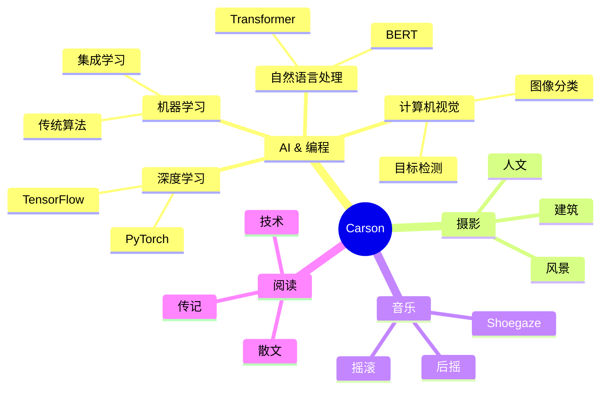

<div align="center">
  
<!-- 动态打字效果 -->
<div align="center">
  <a href="https://blog.sunguoqi.com/">
    
  </a>
</div>

<!-- 个人资料徽标 -->
<div align="center">
  <a href="https://blog.sunguoqi.com/"></a>&emsp;
  <a href="https://twitter.com/"></a>&emsp;
  <a href="https://www.youtube.com/"></a>&emsp;
  <a href="https://space.bilibili.com/"></a>&emsp;
  <a href="https://www.zhihu.com/"></a>&emsp;
</div>

## 🌈 About Me

```python
# Terminal Style Output
print("""
╭──────────────── PROFILE ────────────────╮
│                                         │
│  🤖 Initializing AI Developer Profile   │
│  ⚡ Loading Skills and Configurations   │
│                                         │
╰─────────────────────────────────────────╯
""")

class Carson:
    def __init__(self):
        self.status = "⚡ Online"
        self.name = "🎯 Carson"
        self.role = "🤖 AI Developer & Researcher"
        self.location = "🌍 Earth"
        
        # Core Attributes
        self.personality = "🎨 INFP"
        self.languages = {
            "Programming": ["Python", "C++", "JavaScript"],
            "Human": ["🇨🇳 Chinese", "🇺🇸 English"]
        }
        
        # Tech Arsenal 🚀
        self.tech_stack = {
            "🧠 Deep Learning": ["PyTorch", "TensorFlow", "Keras"],
            "🔬 Machine Learning": ["Scikit-learn", "XGBoost", "LightGBM"],
            "📊 Data Science": ["NumPy", "Pandas", "Matplotlib"],
            "🛠️ Tools": ["Jupyter", "Git", "Docker", "Linux"]
        }
        
        # Current Focus
        self.current_learning = "🎯 Advanced Deep Learning Architectures"
        self.interests = ["🤖 AI", "📸 Photography", "🎵 Music", "📚 Reading"]

    def say_hi(self):
        print(f"""
╭──────────── Welcome Message ───────────╮
│                                        │
│  🌟 Hey there, fellow developer!       │
│  💻 Thanks for visiting my profile     │
│  🚀 Let's build something amazing!     │
│                                        │
╰────────────────────────────────────────╯
        """)

# Initialize Profile
me = Carson()
me.say_hi()

# Loading animation
print("[■■■■■■■■■■] 100% Profile Loaded!")
```

## 🚀 Skills & Tools

### 💻 Programming Languages & AI Frameworks


### 🛠 Web Technologies & Tools


## 🎯 Interests



## 📚 Recent Reading

- 《我与地坛》 - 史铁生 ⭐⭐⭐⭐⭐
- 《活着》 - 余华 ⭐⭐⭐⭐⭐
- 《肖申克的救赎》 - 斯蒂芬·金 ⭐⭐⭐⭐⭐

## 📊 GitHub Stats

<div align="center">
  
</div>

## 🌟 Favorites Quote

> "We're making the world a better place. Through constructing elegant hierarchies for maximum code reuse and extensibility."

---

<div align="center">
  
</div>
