<div align="center">
  
<!-- 动态打字效果 -->
<div align="center">
  <a href="https://blog.sunguoqi.com/">
    
  </a>
</div>

<!-- 个人资料徽标 -->
<div align="center">
  <a href="https://blog.sunguoqi.com/"></a>&emsp;
  <a href="https://twitter.com/"></a>&emsp;
  <a href="https://www.youtube.com/"></a>&emsp;
  <a href="https://space.bilibili.com/"></a>&emsp;
  <a href="https://www.zhihu.com/"></a>&emsp;
</div>

## 🌈 About Me

```python
class Carson:
    def __init__(self):
        self.name = "Carson"
        self.role = "AI Developer & Researcher"
        self.language_spoken = ["zh_CN", "en_US"]
        self.personality = "INFP"
        self.tech_stack = {
            "Deep Learning": ["PyTorch", "TensorFlow", "Keras"],
            "Machine Learning": ["Scikit-learn", "XGBoost", "LightGBM"],
            "Data Science": ["NumPy", "Pandas", "Matplotlib", "Seaborn"],
            "Tools": ["Jupyter", "Git", "Docker", "Linux"]
        }
        
    def say_hi(self):
        print("Thanks for dropping by! Hope you find something interesting.")

me = Carson()
me.say_hi()
```

## 🚀 Skills & Tools

### 💻 Programming Languages & AI Frameworks


### 🛠 Web Technologies & Tools


## 🎯 Interests

```mermaid
mindmap
  root((Carson))
    AI & 编程
      深度学习
        PyTorch
        TensorFlow
      机器学习
        传统算法
        集成学习
      计算机视觉
        目标检测
        图像分类
      自然语言处理
        Transformer
        BERT
    摄影
      人文
      建筑
      风景
    音乐
      摇滚
      后摇
      Shoegaze
    阅读
      散文
      传记
      技术
```



## 📚 Recent Reading

- 《我与地坛》 - 史铁生 ⭐⭐⭐⭐⭐
- 《活着》 - 余华 ⭐⭐⭐⭐⭐
- 《肖申克的救赎》 - 斯蒂芬·金 ⭐⭐⭐⭐⭐

## 📊 GitHub Stats

<div align="center">
  
</div>

## 🌟 Favorites Quote

> "We're making the world a better place. Through constructing elegant hierarchies for maximum code reuse and extensibility."

---

<div align="center">
  
</div>
