  
  <!-- dynamic typing effect 动态打字效果 -->
  

    
  

  <!-- knock code pictures 敲代码的图片 -->
   

  <!-- profile logo 个人资料徽标 -->
  

   
、

  <!-- Snake Code Contribution Map 贪吃蛇代码贡献图 -->
  

#  🙋 Hello

<table>
<tr><td>

<!-- About me 关于我 -->
### 🤺 About Me
  

&emsp;&emsp;大家好，我是Carson，一枚INFP

&emsp;&emsp;热爱编程、摄影、读书、旅行。

&emsp;&emsp;热爱计算机科学和IT互联网事业，励志成为一名优秀的独立开发者。

&emsp;&emsp;希望这个世界变得更加美好

<strong>&emsp;&emsp;We're making the world a better place. Through constructing elegant hierarchies for maximum code reuse and extensibility.</strong>

</td></tr>

<tr>
<td>
  

### 🤾‍♂️ Funny Soul

<!-- START_SECTION:douban -->
* <a href='https://book.douban.com/subject/1209899/' target='_blank'>最近在读我与地坛</a> 🌟🌟🌟🌟🌟 力荐- 2023-04-17
* <a href='http://movie.douban.com/subject/1292052/' target='_blank'>看过肖申克的救赎</a> 🌟🌟🌟🌟🌟 力荐- 2023-02-07
* <a href='http://movie.douban.com/subject/1292365/' target='_blank'>看过活着</a> 🌟🌟🌟🌟🌟 力荐- 2023-02-07
* <a href='https://open.spotify.com/artist/3HXSUfI76zVZk71UMAeVfp' target='_blank'>听过草东没有派对</a> 🌟🌟🌟🌟🌟 力荐- 2023-02-07
<!-- END_SECTION:douban -->

</td></tr>

<tr><td>

<!-- ########################################## 分割 ########################################## -->

<!-- just img 图片 -->

<!--  skill badge 技能徽章 -->

```mermaid
mindmap
  root((Carson))
    编程
      Web开发
      Java
      Python
    摄影
      人文
      建筑
      风景
    音乐
      摇滚
        后摇
        另类
      流行
    旅行
      大连
      南京
      合肥
      阳朔
    阅读
      短篇散文
      人物传记
      个人成长
      社会文化
      心理
      计算机技术
```

💪 正在学习

  
🧠 计划学习

🧰 常用的工具

<!-- programming tool icon 编程工具图标 -->
 

<!-- just img 图片 -->

<!-- ########################################## 分割 ########################################## -->

  
<!-- Quotes 名人名言 -->
 

<!-- Awesome repo 比较好的仓库-->

  
 

<!-- ########################################## 分割 ########################################## -->

<!-- run 图片 -->

<!-- Joke 笑话 -->

<!-- ########################################## 分割 ########################################## -->

<!-- just img 图片 -->

<!-- just img 图片 -->

